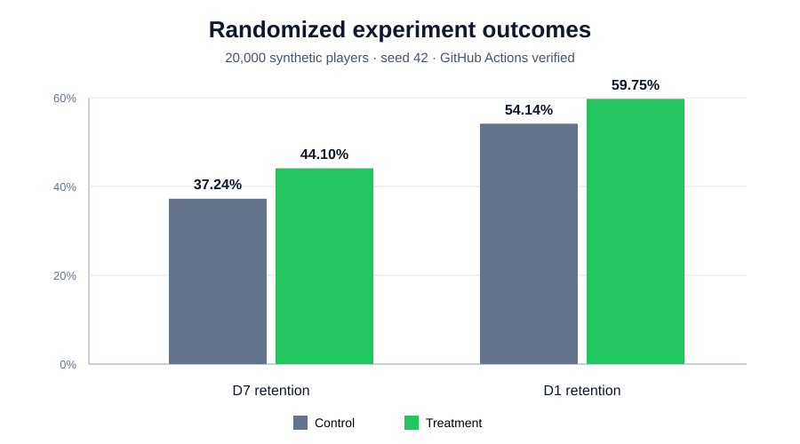
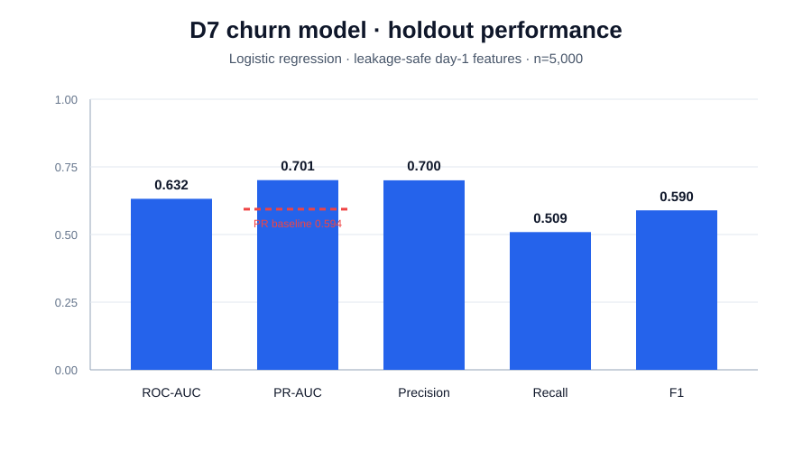
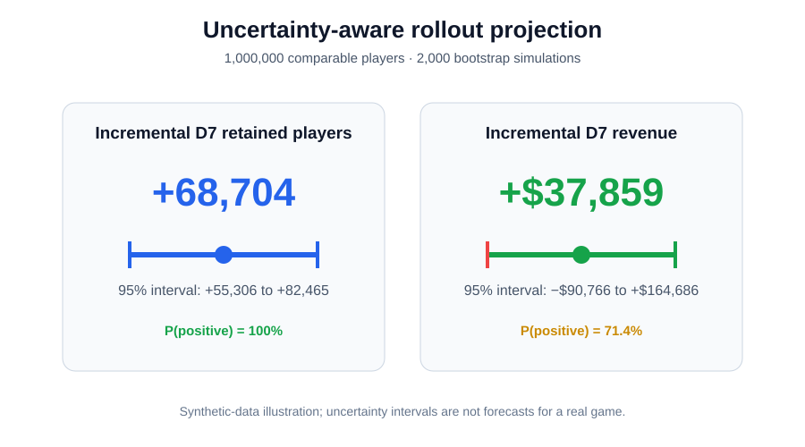

# Mobile Game Experimentation Lab

[](https://github.com/lukap03/mobile-game-experimentation-lab/actions/workflows/tests.yml)

An end-to-end data-science portfolio project for a hypothetical free-to-play mobile game. It demonstrates experiment design, statistical inference, churn modelling, uncertainty-aware rollout projections, SQL telemetry transformation, automated testing, and reproducible reporting.

> **Synthetic-data disclosure:** every player, event, outcome, and monetary value in this repository is programmatically generated. No real users, game telemetry, or company data are used. Results demonstrate the methodology and are not claims about a real product.

## Business question

Does a streamlined onboarding experience improve **D7 retention** without harming monetization?

- **Primary metric:** D7 retention
- **Secondary metrics:** D1 retention and day-1 sessions
- **Guardrail:** D7 ARPU
- **Assignment:** 50/50 randomized control and treatment
- **Decision principle:** combine effect size, uncertainty, practical importance, and guardrail risk

## Verified results

The complete pipeline was executed in [GitHub Actions run #13](https://github.com/lukap03/mobile-game-experimentation-lab/actions/runs/34862962467) with 20,000 synthetic players and seed 42. Both pytest jobs and the full analysis job passed. Machine-readable values are committed in [reports/metrics.json](reports/metrics.json).

### Experiment health

- Treatment allocation: **49.64%** (9,928 of 20,000 players)
- Sample-ratio-mismatch p-value: **0.312**
- Approximate D7 minimum detectable effect at 80% power: **1.92 percentage points**

The SRM test does not indicate an assignment imbalance. Passing SRM is a data-quality check, not proof that every implementation issue is absent.

### Experiment readout

| Metric | Control | Treatment | Absolute uplift | 95% CI | p-value |
|---|---:|---:|---:|---:|---:|
| D7 retention — primary | 37.24% | 44.10% | **+6.86 pp** | [5.50, 8.21] pp | <0.001 |
| D1 retention | 54.14% | 59.75% | **+5.61 pp** | [4.24, 6.98] pp | <0.001 |
| Day-1 sessions | 1.45 | 1.59 | **+0.14** | [0.12, 0.16] | <0.001 |
| D7 ARPU — guardrail | $1.20 | $1.24 | +$0.04 | [-$0.09, $0.17] | 0.560 |



The synthetic treatment produces a statistically and practically clear retention improvement. The ARPU interval crosses zero, so the experiment does **not** establish either an increase or a decrease in revenue. In a real experiment I would predefine a non-inferiority margin before claiming that the monetization guardrail passed.

### Product recommendation

For a comparable real population, these results would support a **staged rollout** of the onboarding change while continuing to monitor ARPU and technical guardrails. Segment results are exploratory and should be validated in a follow-up experiment rather than treated as confirmed heterogeneous effects.

## Churn model

A logistic-regression pipeline predicts D7 churn using only information available by the end of day 1:

- experiment assignment and player profile,
- tutorial completion,
- first-day sessions, playtime, progression, and spend.

D7 outcomes and later revenue are explicitly excluded to prevent target leakage. Preprocessing and modelling are kept inside one scikit-learn `Pipeline` with imputation, scaling, one-hot encoding, and class-balanced logistic regression.

| Holdout metric | Value |
|---|---:|
| ROC-AUC | 0.632 |
| PR-AUC | 0.701 |
| PR-AUC prevalence baseline | 0.594 |
| Precision | 0.700 |
| Recall | 0.509 |
| F1 | 0.590 |
| Brier score | 0.237 |



The model provides moderate ranking signal, not production-ready performance. Tutorial completion and playtime are the strongest reported predictors of lower churn probability. Coefficients are predictive associations and should not be interpreted as causal effects.

## Uncertainty-aware rollout projection

The projection resamples experimental uncertainty and scales treatment-minus-control effects to one million comparable players.

| Projection | Mean | 95% simulation interval | P(positive) |
|---|---:|---:|---:|
| Incremental D7 retained players | +68,704 | [+55,306, +82,465] | 100% |
| Incremental D7 revenue | +$37,859 | [-$90,766, +$164,686] | 71.4% |



This is an uncertainty-aware scenario projection, not a forecast for a real game. It assumes the synthetic experiment population is representative of the rollout population and does not model novelty effects, interference, seasonality, or long-term player behavior.

## Statistical methodology

- Binary outcomes: two-proportion z-test with an unpooled Wald confidence interval for the absolute difference.
- Continuous outcomes: Welch's t-test and normal-approximation confidence interval.
- All metrics: seeded non-parametric percentile bootstrap intervals.
- Assignment health: exact binomial SRM test.
- Sensitivity: approximate two-sided minimum detectable effect at 80% power.
- Segments: exploratory effects by platform, country, and acquisition channel; no multiplicity-adjusted confirmatory claims.

The primary metric is specified before reading segment results. Statistical significance alone is not treated as a product decision.

## SQL telemetry layer

[sql/telemetry_aggregation.sql](sql/telemetry_aggregation.sql) demonstrates how raw `game_events` and experiment assignments could be transformed into leakage-auditable player-level D1/D7 features. [sql/experiment_readout.sql](sql/experiment_readout.sql) calculates variant metrics and absolute uplifts in PostgreSQL.

The Python generator produces an analytical player-level table directly; the SQL files document the corresponding warehouse transformation for a production event stream.

## Repository layout

```text
src/
  data_generation.py      deterministic synthetic population
  experiment.py           inference, SRM, MDE, and segment analysis
  modeling.py             leakage-safe churn pipeline
  projection.py           bounded-memory rollout simulation
  visualization.py        publication-ready charts
  run_analysis.py         end-to-end CLI
sql/                      telemetry aggregation and experiment readout
tests/                    data, inference, model, and projection tests
reports/metrics.json      CI-verified machine-readable results
reports/figures/          visible portfolio charts
.github/workflows/        tests plus full reproducibility run
```

## Run locally

Python 3.10+ is supported.

```bash
git clone https://github.com/lukap03/mobile-game-experimentation-lab.git
cd mobile-game-experimentation-lab
python -m venv .venv
```

Linux/macOS:

```bash
source .venv/bin/activate
```

Windows PowerShell:

```powershell
.venv\Scripts\Activate.ps1
```

Install and run:

```bash
python -m pip install -r requirements.txt
python -m src.run_analysis
python -m pytest -q
```

The generated player CSV is intentionally ignored because it is fully reproducible. GitHub Actions runs tests on Python 3.10 and 3.12, executes the complete deterministic analysis, and publishes the report files as a workflow artifact.

## Production extensions

With real production telemetry I would:

1. define the event contract, ownership, freshness checks, and exposure logging;
2. validate randomization using SRM and pre-treatment covariate balance;
3. perform power analysis before launching the experiment;
4. add CUPED using a truly pre-experiment engagement covariate;
5. use cluster-robust or sequential methods if the experiment design requires them;
6. evaluate calibration, drift, subgroup performance, privacy, and intervention ethics before operationalizing churn scores;
7. monitor long-term retention, payer conversion, crashes, latency, and economy health during staged rollout.

## Responsible interpretation

Synthetic data makes the project safe and reproducible, but also means the conclusions are constructed by the data-generating process. The value of the repository is the analytical workflow, testing discipline, and transparent interpretation—not the magnitude of the simulated uplift.

## License

Released under the [MIT License](LICENSE).
